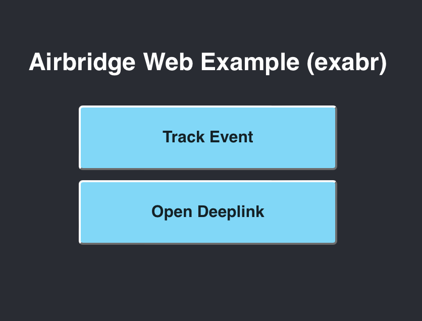
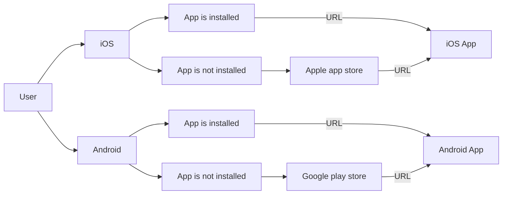

# airbridge-web-example

Example web application of Airbridge Web SDK.



You can replace app and token on [app.tsx](src/components/app.tsx).

```typescript
useEffect(() => {
    // To use your app and webToken, comment this part
    // ---
    const url = new URL(window.location.href)
    const app = (
        optional.actual(url.searchParams.get('app'), 'exabr')
    )
    if (app === undefined) {
        setContext(undefined)
        return
    }

    setContext({
        app,
        webToken: AIRBRIDGE_TOKEN[app],
    })
    // ---

    // To use your app and webToken, uncomment this part
    // And replace 'YOUR_APP' and 'YOUR_WEB_TOKEN'
    // ---
    // setContext({
    //     app: 'YOUR_APP',
    //     webToken: 'YOUR_WEB_TOKEN',
    // })
    // ---
}, [])
```

## Track Event

```typescript
const trackEvent = (category: string) => {
    airbridge.events.send(category)
}
```

When `Track Event` button is clicked, `Web Event` which has category `example-event` is transmited to Airbridge Server.

When web application is loaded on [airbridge-ios-example](https://github.com/ab180/airbridge-ios-example) app's WebView or [airbridge-android-example](https://github.com/ab180/airbridge-android-example) app's WebView, `App Event` which has category `example-event` is transmited to Airbridge Server.

> Airbridge's hybrid setting feature

## Open Deeplink

```typescript
const openDeeplink = (url: URL) => {
    airbridge.openDeeplink({
        type: 'click',
        deeplinks: {
            ios: url.href,
            android: url.href,
            desktop: 'https://airbridge.io',
        },
        fallbacks: {
            ios: 'itunes-appstore',
            android: 'google-play',
        },
    })
}
```

When `Open Deeplink` button is clicked,
- If user's OS is `iOS`,
    - If [airbridge-ios-example](https://github.com/ab180/airbridge-ios-example) is installed,
        - Then user moves to [airbridge-ios-example](https://github.com/ab180/airbridge-ios-example) app with `exabr://deeplink` URL.
    - If [airbridge-ios-example](https://github.com/ab180/airbridge-ios-example) is not installed,
        - Then user moves to Apple App Store.
        - And then if user install [airbridge-ios-example](https://github.com/ab180/airbridge-ios-example) and open it.
        - And then user moves to [airbridge-ios-example](https://github.com/ab180/airbridge-ios-example) app with `exabr://deeplink` URL.
            > Airbridge's deferred deeplink feature
    
- If user's OS is `Android`,
    - If [airbridge-android-example](https://github.com/ab180/airbridge-android-example) is installed,
        - Then user moves to [airbridge-android-example](https://github.com/ab180/airbridge-android-example) app with `exabr://deeplink` URL.
    - If [airbridge-android-example](https://github.com/ab180/airbridge-android-example) is not installed,
        - Then user moves to Google Play Store.
        - And then if user install [airbridge-android-example](https://github.com/ab180/airbridge-android-example) and open it.
        - And then user moves to [airbridge-android-example](https://github.com/ab180/airbridge-android-example) app with `exabr://deeplink` URL. (Airbridge's deferred deeplink feature)
            > Airbridge's deferred deeplink feature



> User moves to [AB180 Blog](https://play.google.com/store/apps/details?id=product.dp.io.ab180blog)'s Apple App Store and Google Play Store alternatively because [airbridge-ios-example](https://github.com/ab180/airbridge-ios-example) and [airbridge-android-example](https://github.com/ab180/airbridge-android-example) is not published on Apple App Store and Google Play Store.
